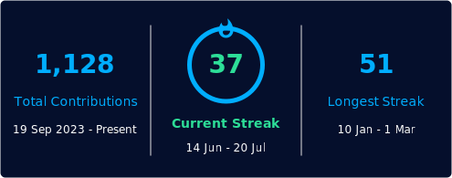

<h1 align="center">👋 Hi, I'm Prateek Purohit</h1>

```⠀⠀⠀⠀
⡔⡁⡈⠘⢽⢟⣾⡿⡑⠄⡂⠋⢂⠨⡨⣷⣽⣿⣿⣿⣿⣾⣿⣼⣾⣿⣿⣿⡠⢀⠢⠀⠄⠂⡀⢂⠠⠀⡀⡀⠄⠀⠀⠄⠀⠀         prateek@purohit:
⠠⢷⢲⣽⣌⣯⣻⣰⢈⠅⠐⢀⠢⡀⣺⣻⣿⢿⡿⢿⠟⣿⢿⢻⢿⡿⢝⠋⠂⠄⠐⠀⠂⠁⠀⠀⠀⢀⠀⠀⠐⠐⠀⠄⡀⠀⠀        --------------------
⠠⣳⣿⣇⢧⣿⣿⡂⡑⢈⣞⠐⣤⣽⣿⣿⡿⣗⡒⠌⠌⡑⠨⠂⠅⠂⠀⠂⠀⠀⢀⠠⠀⠂⠁⠀⡀⠀⡈⠀⠈⠀⠂⢀⠡⠐          - OS:............... Arch Linux, Windows 11
⣦⣥⣺⣿⣿⣾⣿⣿⣷⡢⢺⣟⣧⣿⣿⣿⣟⠟⢕⢨⡆⠠⠀⠅⠀⠀⠀⠀⠀⠀⠀⠀⠀⠀⠀⠀⠀⠀⠀⠀⡀⠀⠀⠀⠀⠀⠄⠁⡂⠌⠀⠀⠀⠀  - Host: ............. Lenovo
⣿⣿⣿⣿⣿⣿⣿⣿⣯⣖⣽⣯⣿⣿⣿⣿⣪⡓⡑⢄⠜⠩⠀⠀⠀⠀⠀⠀⠀⠀⠀⠀⠀⠀⠀⠀⠀⠀⠀⠀⠈⠀⠄⠁⠀⠠⠀⠀⠂⠄       - IDE: ............... Zed, VS Code
⣿⣿⣿⣿⣿⢿⡏⣳⣿⣿⣿⣿⣿⣿⣿⣿⣋⢂⠄⠂⢎⢃⠁⡀⠀⠠⠀⠀⢀⠀⠀⡀⠀⠀⠀⠀⠀⠂⠁⠀⠀⢀⠀⠀⡀⠂⠀⠐⠀⠁⡐⠀   - Languages.Core: .... Go, C++, Python
⣿⢟⢿⣿⢟⢟⣼⣿⢿⡿⡿⣿⣿⡿⣿⣿⣿⡘⡌⡄⠑⡠⠀⡀⠐⠀⠀⠀⠄⠄⢂⢀⠂⡁⠄⠠⠀⠀⠀⠀⠀⠀⠀⠀⠀⠀⠀⠐⠈⠀⠐⠀⠀  --------------------------------------
⢈⢂⠉⠅⢣⣱⡻⣿⣿⣿⣿⣼⣻⣿⣻⢿⣿⣿⣽⣮⣶⣶⡀⠀⠀⠀⠀⠄⠅⡅⢕⢐⢐⠠⠡⠐⠀⠄⢀⠀⠀⠄ ⢀⠀⠀⠀⢀⠀⠄⠈⠀⠀⠀- Interests: ... Cybersecurity, Distributed Systems,
⠒⢄⡁⠂⢂⢪⣙⠏⡟⢝⣿⣿⣿⣿⣿⣿⣾⣿⣿⣿⣿⣿⡇⠄⠂⠀⠀⢌⠪⡘⡌⡆⢕⠅⡅⠅⢌⢐⠠⠐⡀⠄⢂⠠⠐⠈⠀⠀ ⠀⠐   ....................... Systems Programming, DevOps,
⠀⠁⠀⠈⢀⠂⠌⠒⢌⠜⡊⠿⣿⣿⣿⣿⣿⣿⣿⣿⣿⣿⣯⠀⠀⢀⠪⠢⡑⠕⠡⠁⠅⠑⠨⢈⢂⠢⢈⠂⡂⠅⠂⡂⠅⢅⠀⠀⠀⠀⠂   ..................... eBPF.  
⠀⢁⠀⢑⢀⠀⠅⠅⡸⣂⠢⡑⢽⣿⣿⣿⣿⣿⣿⣿⣿⣿⣻⡀⡀⢂⠣⡃⠂⠄⠠⠀⠀⠀⢀⠀⠄⡈⠀⠀⠀⠀⠀⠀⠡⢱⢐⠀⠀⡈⠀⠀⠀  - Hobbies: ........... OSS Tooling, CTFs, 
⠀⠀⡀⠐⡢⡀⠎⡰⡌⢷⣜⣬⡳⣿⣿⣿⣿⣿⣿⣿⣿⡏⡂⠅⠄⡰⡁⡂⡁⠠⠀⡀⠀⠂⢀⠈⡐⠄⠁⠂⠀⠀⠁⠀⠂⢐⢕⢀⠀⠀⠀⢀  ..................... Projects, Football
⠀⠠⠀⣢⡪⡢⡈⠅⢌⢌⣿⣷⣿⣿⣿⣿⣿⣿⣿⣿⣿⡂⡪⠀⠅⡢⠪⡢⡪⠠⠡⢀⠂⡈⢄⢐⢜⢜⠄⠂⢁⠀⡁⠠⢀⠂⢅⠂⡂⠢⠀⠀ - Contact -----------------------------
⠀⡐⠀⣾⣿⣾⣮⣿⣾⣿⣾⣿⣿⣿⣿⣿⢿⣿⣿⣿⣿⡪⡀⡂⡑⠨⡊⡪⢪⠱⡑⢅⢃⢊⢐⢜⢜⢜⢌⠐⢄⢂⠔⢌⠆⠕⡌⡆⢐⠈⠄  - Email: ............. contact@prateekpurohit.tech
⣌⣷⢬⣿⣿⣿⣿⣿⣿⣟⣿⣿⢿⣿⣿⣿⣿⡯⣿⣏⡅⢪⢢⢑⠄⡑⢌⢌⠢⢑⠨⠀⠄⢄⠑⠐⢈⠐⠠⠑⠀⡑⡑⠅⠅⢕⠸⡀⠀⢌⠀  - LinkedIn: ........... prateek-purohit-3a96a728a
⣿⣿⣿⣿⣿⣿⣿⣿⣽⣿⣿⣿⣿⣿⣿⣿⣿⣿⣷⣷⣿⣇⡇⡑⠅⢂⢂⠂⠅⡀⠂⠈⠐⠀⠂⠀⠀⠀⠀⠌⠂⠄⢂⠡⠡⠡⡑⡐⢌⡂    - Website: ............ prateekpurohit.tech⠀⠀
⣿⣿⣿⢿⣾⣿⣿⣿⣿⣿⣿⣷⣿⣿⣿⣿⣿⣿⣿⣷⣿⣿⡨⡞⢾⡐⡀⢂⠁⡂⠁⡀⢈⢀⢁⠈⡀⠈⠀⠀⠁⠈⠄⢂⠡⢑⠐⢄⠣⠂   - GitHub: ............. prateekpurohit13⠀⠀
⣿⣿⣻⣽⣿⣿⣿⢿⣿⣿⣿⣿⣿⣿⣿⣿⣿⣿⣿⣿⣷⣗⠟⣟⠳⡇⡐⠀⠂⠄⠡⠐⡐⡀⠂⡀⠂⠁⠌⠠⡈⠀⠨⠠⠈⡐⣈⢆⠀     - Currently ---------------------------
⣟⣿⣿⣿⣿⣻⢯⣿⣿⣿⣿⣿⣿⣿⣿⣿⣿⣿⣿⣿⣿⢿⡛⠌⢅⢨⠠⠈⠀⠌⠀⠅⡐⠄⠅⠔⡀⡂⠌⡀⠂⡁⠄⢁⠐⣰⡨⠀⠀     - Working on: .. Backend Dev, API & Agentic Security,
⣯⢿⣿⣿⣿⣿⣻⣟⣿⡿⣿⣿⣿⣿⣿⣿⣿⣿⣿⣿⢿⣷⣧⢳⢣⡨⡪⡀⢀⠀⠄⠀⢀⠈⠈⠀⠂⠀⢀⠀⠀⠀⠀⡀⣼⣾⠀⠀        - Learning: ........... AWS, CyberSec, DevOps
⢿⠹⡝⡯⣯⢫⣟⢿⣻⣟⣿⣽⣿⣿⣿⣿⣿⣿⣿⢿⣿⣽⣟⡮⠊⠄⡪⠢⡀⠀⠀⠀⠀⠀⠀⠀⡀⠀⠀⠀⠀⠂⠁⢄⣿⠀⠀   
⢽⢪⢹⢪⣪⢗⣿⡽⣷⣳⣝⢾⢯⢿⣽⡾⣿⡿⣞⣟⡷⣟⣷⢿⣱⢱⡑⡕⠄⠅⡀⠄⠀⠀⠀⡀⠀⠀⢀⠠⠀⢐⠨⢰⠂⠀⠀  
⢧⢳⡈⢷⢝⢾⣕⢯⣗⡷⣿⣧⡫⢽⢽⢿⣟⡿⡫⡗⣿⡻⣯⣟⢾⢝⠜⠌⢌⢂⠂⡂⡈⠠⠀⠄⢀⠂⡀⠄⠨⠠⠨⣸⠀⠀⠀⠀⠀⠀⠀⠀⠀⠀⠀
⡳⡱⡱⡸⡕⡷⡝⣕⢳⢽⣳⣳⢭⡳⡽⣽⣳⣿⡻⠪⢚⠚⡊⡌⡎⢎⠪⡨⢂⠂⠅⡂⡐⠠⢁⠐⠀⠄⠠⠈⠄⠅⠢⠹⠄⠀
⡪⡪⡳⣱⡱⡹⡝⡔⡱⡕⣷⣻⢽⡽⡝⠎⠣⠑⠈⠠⠀⠠⠀⢕⢪⢪⢨⠨⡂⠅⠅⡐⠠⠈⠄⢂⠁⠄⠡⠨⠠⠁⠅⢇⠈⠻⣞⠀⠀⠀⠀⠀⠀⠀⠀
⢪⡺⡜⣼⡲⡹⡮⣮⢾⠼⡚⠪⠉⠌⢀⠈⡀⠂⢁⠐⠀⠄⠀⠀⠑⠕⡔⢅⢂⠅⡂⠂⠅⠌⢐⠀⡂⢈⠐⠨⠠⠡⡑⢕⠅⠀⡀⠑⠝⠀⠀⠀⠀
⢕⣕⢝⡮⣯⢯⠺⠨⠁⠌⠠⠈⠀⠂⠠⠀⡀⠂⠠⠐⠈⢀⠈⡀⠄⠀⠈⠂⠢⠱⡐⠅⠅⠌⠄⡂⡐⠠⠨⠨⡈⡂⡊⠆⠂⠀⡀⢈⠐⢀⠉⠳⠀⠀
⡢⣓⢯⢟⠩⠐⠀⠂⠐⠀⠂⢈⠀⠁⠐⠀⠠⠐⠀⠐⠈⠀⡀⢀⠠⠀⠂⠀⡀⠀⠈⠈⠁⠡⠑⠰⠨⠌⠪⠪⠊⠊⠈⠀⠀⠄⠀⠄⠂⡐⢀⠡⠀⠌⠋⠿⠀⠀⠀⠀
⠵⡕⢍⠐⢀⠈⡀⠁⠈⠀⠁⠠⠀⠈⠀⠈⠀⠠⠈⡀⠈⠀⡀⠀⡀⠀⠄⠀⡀⠀⠂⠀⡀⠀⠀⠀⠀⡀⠀⡀⠀⠠⠀⠂⠀⠐⠀⠂⢁⠠⠀⢂⠐⢈⠠⠈⡀⢉⠳⣧⡀⠀⠀⠀⠀
⢝⠌⠄⠐⠀⠀⡀⠀⠁⠀⠠⠐⠀⠀⠈⠀⠁⠀⠄⠀⡀⠁⠀⡀⠀⠄⠐⠀⠀⠄⠂⠀⡀⠀⠁⠈⠀⠀⡀⠀⠠⠀⠄⠐⠈⢀⠈⠠⠀⡐⠈⠠⠐⠀⠄⠂⠀⠄⠠⠈⢗⠀⠀⠀
⢑⠀⠐⠀⠁⠀⠀⠀⡀⠄⠀⠀⠄⠀⠈⠀⠈⢀⠐⠀⠀⠠⠀⠠⠀⠄⠂⠈⠀⠄⠂⠁⡀⢈⠀⡁⢈⠀⠠⠐⠀⠐⠀⠂⢈⠀⠄⠁⠄⠠⠈⠠⠈⠠⠀⠂⠁⠐⠀⠂⠀⠳⠀
⠀⡀⠂⠁⠈⠀⠀⠁⠀⠀⠀⠀⠀⠀⠀⠁⠀⠄⠀⠐⠈⠀⠀⠄⠠⠀⠂⠈⡀⠐⢀⠁⠠⠀⠄⠠⠀⡐⠀⠂⢁⠈⡀⢁⠠⠀⠂⠁⠄⠂⢀⠁⡈⢀⠂⠀⠐⠈⠀⠈⠀⠁⢝⠀
⢀⠀⠀⠀⠁⠀⢀⠀⠀⠀⠀⠈⠀⠀⠂⠀⢁⠠⠐⠀⠐⠀⠁⠀⠄⠂⠈⡀⠄⢈⠀⠐⡀⢁⠐⢀⠁⠄⠈⠄⠂⠠⠀⠄⢀⠂⢁⠐⠀⠌⠀⠠⠀⠂⠐⠀⢀⠀⠂⠀⠈⡀⠨
⠀⠀⠀⠁⠈⠀⠀⠀⠀⠠⠐⠀⠀⠀⡀⠈⠀⠀⠀⠠⠀⠂⠀⡁⠀⠂⠁⡀⠄⠠⠀⢁⠠⠀⠐⡀⠐⢈⠀⡂⢁⠐⠀⠌⠀⠄⠠⠀⡁⠐⠈⠀⠂⠁⢈⠀⠀⠀⢀⠠⠀⠠⠀⢸⡲
⠀⠐⠀⠀⠐⠀⠀⠀⠀⠀⠀⠀⠀⡀⠄⠈⠀⠀⠐⠀⢀⠐⠀⠄⢈⠀⡁⠀⠄⠂⠐⠀⡀⠈⡀⠄⢈⠠⠀⠂⠄⠂⢁⠠⠁⠐⠀⢂⠠⠈⢀⠁⡀⠁⠀⠐⠈⠀⠀⠀⠀⠠⠀⠀⢻
⠀⠀⠀⠀⠐⠀⠀⠐⠈⠀⠀⠁⠀⡀⠀⠄⠀⠐⠀⠁⢀⠀⠂⠐⠀⠄⠐⠈⠀⠂⢁⠠⠀⠠⠀⠀⡀⠀⠄⠁⢀⠁⡀⠄⠂⢁⠈⡀⠄⢈⠀⠠⠀⠈⠀⠈⡀⠀⡀⠄⠀⠐⠀⠐⠈
```

<div align="center">
  <table>
    <tr>
      <td>
        <a href="https://git.io/streak-stats">
          
        </a>
      </td>
      <td>
        <a href="https://github.com/anuraghazra/github-readme-stats">
          
        </a>
      </td>
    </tr>
  </table>
  <p align="center">
</div>
<p align="center">
  
</p>

